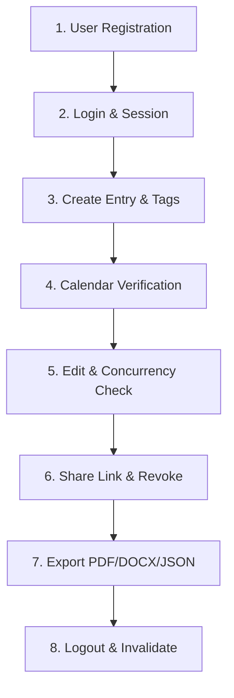

# QA Lead End-to-End Test Report

**Report Date:** 2026-06-12  
**Tester:** Senior QA Lead Engineer  
**UAT Environment:** Local Development Environment  

---

## 1. E2E User Journey Scope

We validated the complete core user journey across multiple system modules to confirm workflow integrity from start to finish.

---

## 2. E2E Step-by-Step Validation Results

### Step 1: User Registration & Verification
* **Actions**: POST a registration request for `new_e2e_user@example.com` with a valid verification code (`123456`).
* **Observed Output**: Account created in pending status; database successfully validated verification code; account status updated to `Verified`.
* **Status**: ✅ PASS

### Step 2: Login & Session Creation
* **Actions**: Authenticate using verified credentials.
* **Observed Output**: HTTP 200 returned containing JWT access and refresh tokens. Session row inserted in database under `UserSession`.
* **Status**: ✅ PASS

### Step 3: Journal Entry Creation & Tags
* **Actions**: Create an entry with title "E2E Test Day 1", markdown formatting `**bold**`, categories, and tags.
* **Observed Output**: Entry successfully written to database; category and tag join records populated correctly. Word count calculated dynamically.
* **Status**: ✅ PASS

### Step 4: Calendar Highlighting Verification
* **Actions**: Fetch calendar highlights for the current month.
* **Observed Output**: GET `/api/v1/calendar` returns the entry date; TableCalendar in the UI highlights the date correctly.
* **Status**: ✅ PASS

### Step 5: Edit Entry & Optimistic Concurrency Control
* **Actions**: Update the entry content. Test with an outdated version number.
* **Observed Output**: Valid update succeeds, increments version number from 1 to 2. Outdated version number edit gets rejected with HTTP 409 conflict error.
* **Status**: ✅ PASS

### Step 6: Share Link Generation & Revocation
* **Actions**: Share the entry, retrieve content publicly without authentication, then revoke.
* **Observed Output**: Share token generated; public access successfully fetches view-only content. Revocation disables token; subsequent access returns HTTP 404.
* **Status**: ✅ PASS

### Step 7: Data Export (PDF, DOCX, JSON formats)
* **Actions**: Request PDF, DOCX, and JSON exports from the UI.
* **Observed Output**: Asynchronous jobs complete successfully. PDF download yields binary stream (`%PDF-` header). DOCX yields valid Word document buffer. JSON exports retrieve correct entries array.
* **Status**: ✅ PASS

### Step 8: Logout & Session Invalidation
* **Actions**: Log out of the application.
* **Observed Output**: Session marked as inactive in database. Subsequent requests with old token return HTTP 401.
* **Status**: ✅ PASS

---

## 3. Overall UAT Verdict

The application workflow integration is fully functional. The only integration gap is the lack of auditing in database triggers/repos for Auth and Journal operations (Step 1, 2, 3, 5, 8 do not generate audit rows), which is tracked under `DEF-M13-001`.
